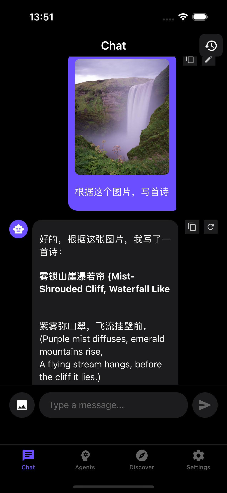
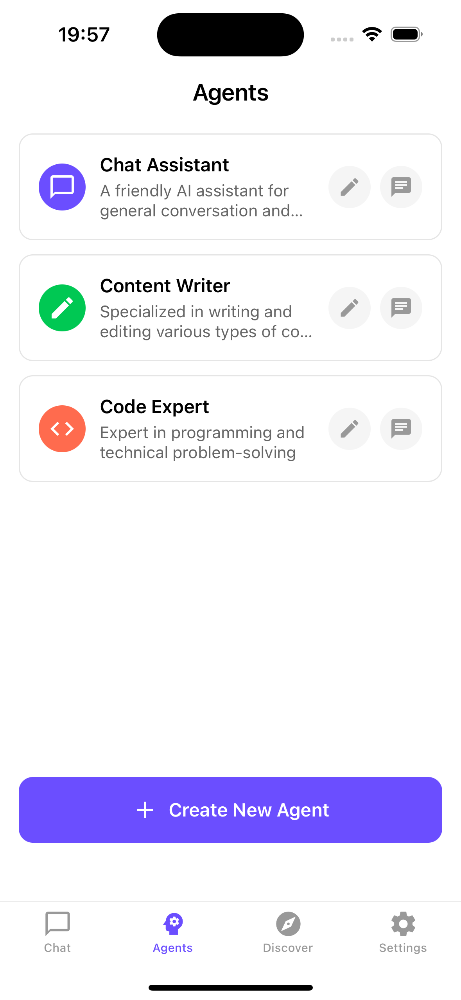
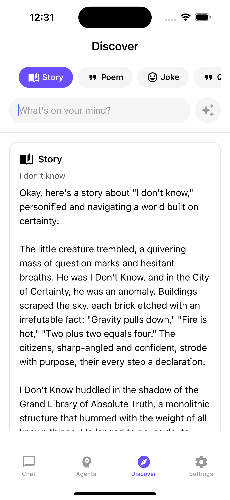
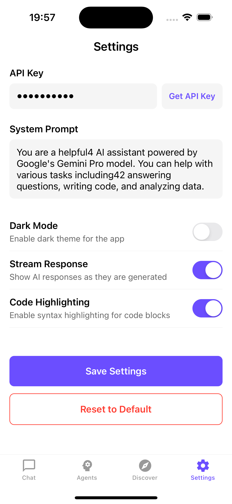
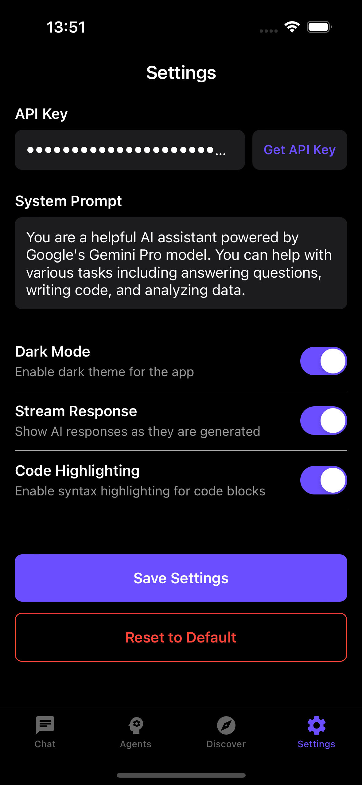

# Gemini Pro Chatbot

A beautiful and feature-rich mobile chat application powered by Google's Gemini Pro AI model. Built with Expo and React Native.

## Features

- 🤖 Powered by Google's Gemini Pro AI model
- 💬 Real-time streaming responses
- 🎨 Beautiful dark theme UI
- 📝 Code syntax highlighting
- 💾 Persistent message storage
- ✏️ Message editing support
- ⚙️ Customizable system prompts
- 🖼️ Image understanding support
- 🎭 Multiple AI agents with different personalities
- 🔄 Message regeneration
- 📱 Cross-platform (iOS & Android)

## Screenshots

### Chat Interface


- Real-time streaming responses
- Code syntax highlighting
- Support for image input
- Dark mode support

### Agents Management


- Create custom AI agents
- Different personalities and purposes
- Customizable system prompts
- Easy agent switching

### Content Discovery


- Generate creative content
- Share interesting responses
- Multiple content types
- Community interaction

### Settings


- Dark mode toggle
- API key management
- System prompt customization
- Stream response settings

### Dark Mode



## Getting Started

1. Install dependencies
   ```bash
   npm install
   ```

2. Configure your API key
   - Get your Gemini Pro API key from [Google AI Studio](https://makersuite.google.com/app/apikey)
   - Add your API key in the app's settings screen

3. Start the app
   ```bash
   npx expo start
   ```

4. Run on your device:
   - iOS: Press 'i' to open in iOS Simulator
   - Android: Press 'a' to open in Android Emulator
   - Scan QR code with Expo Go app on your physical device

## Usage

### Chat Interface
- Type your message in the input box
- Click the image icon to add images for analysis
- Real-time streaming responses
- Code blocks are automatically highlighted
- Edit or regenerate messages as needed

### Agents
- Create custom agents for different purposes
- Each agent has its own personality and system prompt
- Switch between agents for different conversation styles
- Default agents included for common use cases

### Discover
- Generate creative content like stories and poems
- Share interesting AI responses
- Like and collect favorite content
- Explore community-shared content

### Settings
- Customize your experience
- Toggle dark mode
- Manage your API key
- Configure system-wide preferences

## Tech Stack

- Expo / React Native
- Google Gemini Pro API
- React Navigation
- AsyncStorage for persistence
- Syntax highlighting for code blocks
- Expo Image Picker
- React Native Markdown

## Contributing

Feel free to open issues and pull requests for any improvements you'd like to add!

## Follow My WeChat Official Account

Stay updated with the latest AI development tips and tools:

<div align="center">
  
  <p><strong>WeChat Official Account: LaoMa XiaoZhang</strong></p>
  <p>Scan the QR code to follow and get the latest updates on:</p>
  <ul align="left">
    <li>🤖 AI Programming Tips & Tricks</li>
    <li>💻 Full-Stack Development Insights</li>
    <li>🛠️ Productivity Tools and Workflows</li>
    <li>🚀 Latest Tech Trends and Reviews</li>
  </ul>
</div>

## License

MIT License - feel free to use this code for your own projects!
